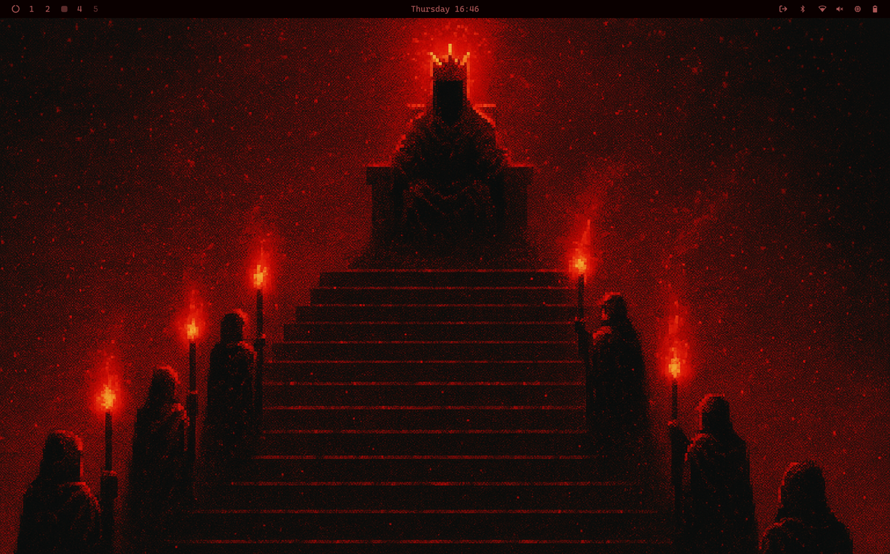

# Demonic Theme for Omarchy OS

A dark red theme for Omarchy OS featuring atmospheric wallpapers and brightened red text on very dark backgrounds. Optimized for night vision with enhanced readability.



## Installation

Install this theme using the Omarchy theme installer:

```bash
omarchy-theme-install https://github.com/potable-anarchy/omarchy-demonic-theme
```

## Theme Features

- **Dark red color palette** with very dark backgrounds for excellent contrast
- **Brightened red text styling** across all applications for improved readability
- **8 atmospheric wallpapers** included with demonic/ritual themes (4 original + 4 authentic pixel art versions)
- **Theme thumbnail** for easy identification in theme selector
- **Complete application coverage**:
  - Terminal (Alacritty)
  - Desktop (Hyprland)
  - Status bar (Waybar)
  - System monitor (btop)
  - Notifications (Mako)
  - Application launcher (Walker)
  - Lock screen (Hyprlock)
  - System UI (SwayOSD)
  - Editor (Neovim)

## Color Palette

- **Primary Background**: `#0A0000` (very dark red)
- **Secondary Background**: `#1A0000` (dark red)
- **Accent Background**: `#3A0A0A` (medium dark red)
- **Primary Text**: `#AA5555` (medium red - night vision friendly)
- **Bright Text**: `#CC6666` (bright red)
- **Secondary Text**: `#994444` (muted red)
- **Inactive Text**: `#883333` (dim red)
- **Highlight/Accent**: `#8B0000` (dark red)
- **Active/Focus**: `#CC0000` (bright red)

## Usage

After installation, the theme will appear as "demonic" in the Omarchy theme selector. Select it to apply the complete theme across your desktop environment.

## Uninstalling

To remove the theme:

```bash
omarchy-theme-remove demonic
```

## What's Included

- **Configuration files** for all major Omarchy applications
- **8 high-quality wallpapers** (4 original + 4 authentic pixel art versions)
- **Theme thumbnail** for the theme selector
- **Consistent color scheme** across terminal, desktop, notifications, and system UI